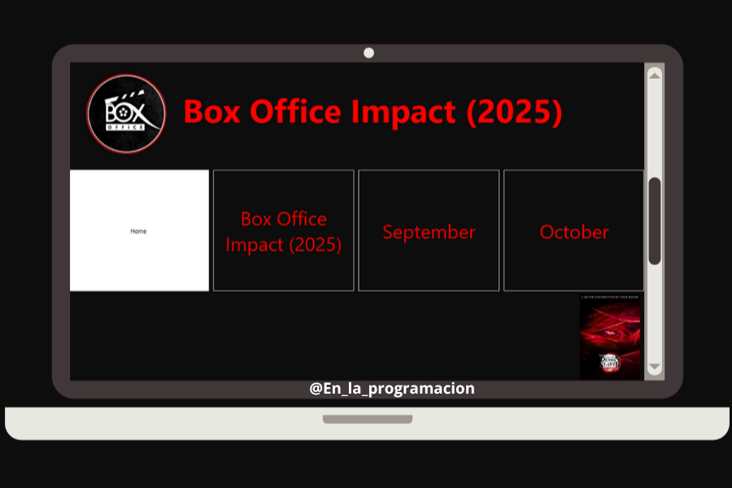
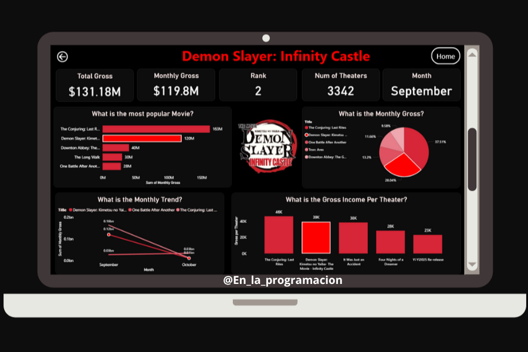

# Box Office Impact 2025 (Demon Slayer: Infinity Castle)

After watching _Demon Slayer: Infinity Castle_, I was deeply moved by its storytelling, animation, and emotional weight. But beyond the cinematic brilliance, I wanted to understand its **global impact**—how it performed in theaters, how fans showed up, and how it stood among other major releases.

This dashboard is my tribute to that journey.

## 🔍 Why I Built This

Inspired by the movie’s intensity and visual style, I created a dashboard that blends **data analysis** with **anime-inspired design**. I wanted fans and analysts alike to explore how _Infinity Castle_ performed across months, theaters, and regions—while feeling the same cinematic energy that the movie delivered.

Using **GSAP animations**, I mirrored the transitions and pacing of the film, turning raw numbers into a scroll-driven experience that feels alive.

## 🌐 Live Demo

- 🔗 Website: [https://infinitycastle.vercel.app](https://infinitycastle.vercel.app)
- 📽️ YouTube Demo: [https://www.youtube.com/watch?v=BlMUOaVkj2g](https://www.youtube.com/watch?v=BlMUOaVkj2g)

## 📈 Key Insights

### September 2025

- 🥈 **Ranked #2** among all movies
- 💰 **Monthly Gross**: $119.8M
- 🏛️ **Theaters**: 3342
- 💸 **Gross Income Per Theater**: $36K

### October 2025

- 🥇 Still held strong at **Rank #8**
- 💰 **Monthly Gross**: $11.38M
- 💸 **Gross Income Per Theater**: $12K

Despite fierce competition from global blockbusters, _Demon Slayer: Infinity Castle_ maintained impressive momentum—showing how deeply fans connected with the story.

## 📊 Dashboard Screenshots

**Dashboard Page**

These dashboards include:

- Bar charts of top-performing movies
- Pie charts of monthly gross distribution
- Line charts showing trend evolution
- Scatter plots of gross vs. theater count
- Per-theater income comparisons

## 🛠️ Tech Stack

- **Frontend**: Next.js, GSAP, ScrollTrigger, SplitText
- **Design**: Anime-inspired UI, symbolic color theory
- **Data**: Box office metrics, theater distribution, trend analysis

## ❤️ For the Fans

This project is more than numbers—it's a love letter to the _Demon Slayer_ community.  
If you're a fan, a data nerd, or a designer who believes in emotional storytelling through analytics, I hope this dashboard resonates with you.

Feel free to explore, share, or reach out with feedback!
